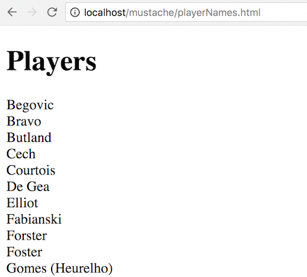

# Mustache Exercise 2 - Mustache Sections (Iteration)
		
> Complete ALL the exercises in this section. Ask thomas.devine@lyit.ie for help or post an *Issue* on your GitHub repository.

## Part 1 – Stations

1.  Examine and open the file [http://localhost/mustache/listStations.html](http://localhost/mustache/listStations.html)

## Part 1 – Players

1.	View the content and structure of the [http://localhost/mustache/players.js](http://localhost/mustache/players.js) file.

1.	Open the files ``playerNames.html`` and ``playerNames.js`` and provide the missing *Mustache* template code that displays the names of each player like this:

	

1.	Open the files ``playerTable.html`` and ``playerTable.js`` and provide the missing *Mustache* template code that displays the data of each player like this:

	

## Part 2 – Clubs

1.	Open and examine the files [http://localhost/mustache/clubsAjaxJSON.html](http://localhost/mustache/clubsAjaxJSON.html), ``clubsAjaxJSON.js`` and ``clubs.json`` 

	This solution does NOT use a Mustache template.

	Update the code so a Mustache template is used to print the clubs in an unordered list.
